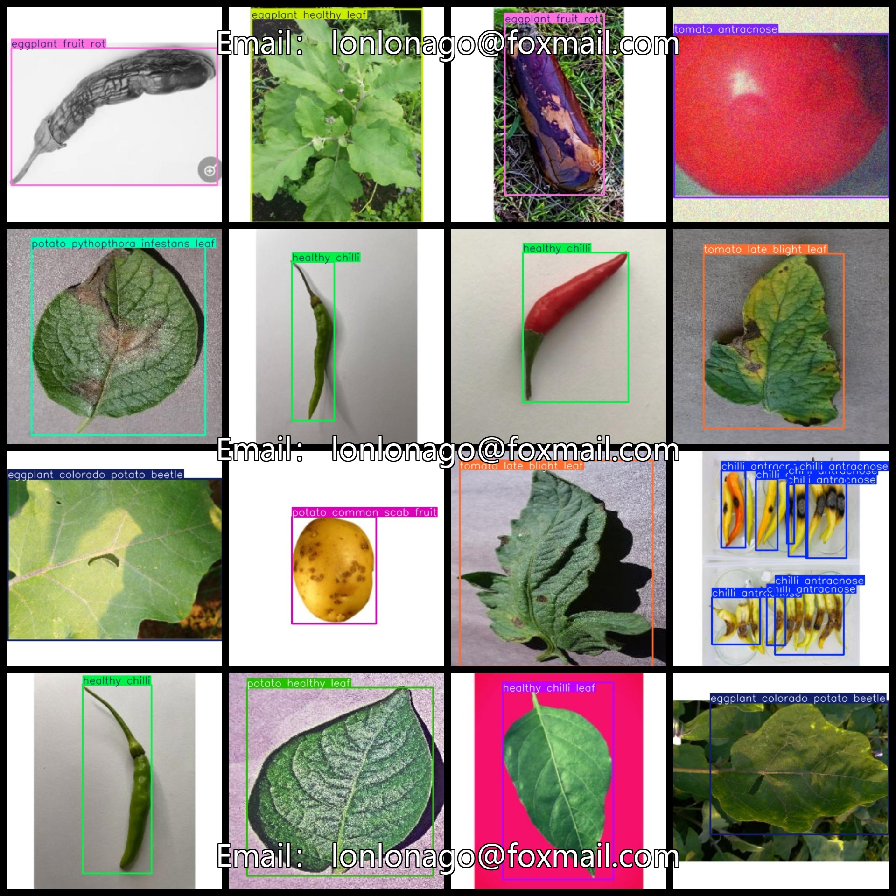
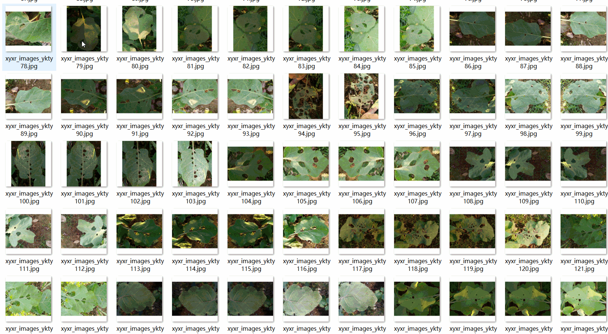

# Vegetable Disease Detection Dataset 7958 Images VOC+YOLO Format

The vegetable disease detection dataset consists of 7958 images in the VOC+YOLO format, organized into three folders for storage: JPEGImages, Annotations, and labels. The total number of JPEG images is 7958, with an accompanying XML file count of 7958 in the Annotations folder and a corresponding txt file count of 7958 in the labels folder. The dataset contains 19 label types, including "chilli antracnose," "chilli bacterial leaf spot," "chilli mosaic leaf virus," "eggplant cercospora leaf spot," "eggplant colorado potato beetle," "eggplant fruit rot," "eggplant healthy fruit," "eggplant healthy leaf," "healthy chilli," "healthy chilli leaf," "potato alternaria solani leaf," "potato common scab fruit," "potato healthy fruit," "potato healthy leaf," "potato pythopthora infestans leaf," "tomato antracnose," "tomato bacterial spot," "tomato healthy," and "tomato late blight leaf."

The frame numbers for each label are as follows:

- Chilli antracnose: 1286
- Chilli bacterial leaf spot: 609
- Chilli mosaic leaf virus: 386
- Eggplant cercospora leaf spot: 434
- Eggplant colorado potato beetle: 288
- Eggplant fruit rot: 541
- Eggplant healthy fruit: 538
- Eggplant healthy leaf: 468
- Healthy chilli: 683
- Healthy chilli leaf: 529
- Potato alternaria solani leaf: 409
- Potato common scab fruit: 493
- Potato healthy fruit: 878
- Potato healthy leaf: 469
- Potato pythopthora infestans leaf: 409
- Tomato antracnose: 423
- Tomato bacterial spot: 403
- Tomato healthy: 524
- Tomato late blight leaf: 414

Total frame counts: 10184

The image clarity is high (resolution: pixel), and there is no enhancement applied to the images. The labeled shapes are rectangular boxes, suitable for target detection recognition.

Special Note: This dataset does not guarantee the accuracy or precision of trained models or weight files; it only provides accurate and reasonable annotations.

Label and Image Details:

## Images

---

Here is a pay link on Stripe (https://buy.stripe.com/3cs8yP7sY87d0vu9AB). Please contact me lonlonago@foxmail.com after funding $89, and I will send you a complete data files, thank you!

